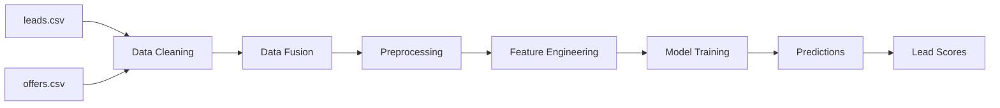

## What is Lead Scoring?

Lead scoring is a predictive model that assigns a numerical value to potential customers (leads) based on their likelihood to convert into paying customers. This project develops a machine learning-based lead scoring system for an Event Management SaaS application.

<Info>
The model predicts the **probability of conversion** by analyzing historical data from the client's sales process, helping prioritize high-value leads and optimize sales efforts.
</Info>

## Business Problem

The client operates an Event Management SaaS platform with a two-phase sales process:

1. **Lead Generation Phase** - Capturing potential clients through various acquisition channels
2. **Offer Phase** - Qualified leads who reach the demo meeting stage

The goal is to predict which leads are most likely to convert to paying customers, enabling the sales team to focus resources effectively.

## The Sales Pipeline

<Steps>
  <Step title="Lead Acquisition">
    Potential clients enter the system through various sources (Inbound, Outbound) and are tracked in the **leads.csv** dataset with information about their use case, source, and geographic location.
  </Step>
  
  <Step title="Lead Qualification">
    Leads are evaluated and may be discarded, nurtured, or advanced to the demo meeting stage based on qualification criteria.
  </Step>
  
  <Step title="Demo & Offer">
    Qualified leads receive product demos and formal offers, tracked in the **offers.csv** dataset with pricing, pain points, and eventual outcomes.
  </Step>
  
  <Step title="Conversion Decision">
    The final status is determined: **Closed Won** (converted), **Closed Lost** (not converted), or **Other** (minority statuses).
  </Step>
</Steps>

## Machine Learning Pipeline

The lead scoring system follows a comprehensive ML pipeline:

### 1. Data Integration

```python
# Merge leads and offers datasets
full_dataset = pd.merge(offers_data, leads_data_cleaned, on='Id', how='left')
```

The two datasets are merged using unique identifiers to create a unified view of each lead's journey from initial contact to final outcome.

### 2. Data Preprocessing

Key preprocessing steps include:

- **Missing value handling** - Imputation strategies for categorical and numerical features
- **Feature engineering** - Extracting temporal features from dates (year, month)
- **Column selection** - Removing irrelevant or redundant features
- **Target mapping** - Consolidating minority classes into "Other" category

### 3. Feature Transformation

<Tabs>
  <Tab title="Categorical Encoding">
    ```python
    # Label encoding for categorical variables
    label_encoder = LabelEncoder()
    categorical_columns = ['Source', 'City', 'Loss Reason', 
                          'Pain', 'Discount code', 'Status', 'Use Case']
    
    for column in categorical_columns:
        full_dataset_preprocessed[column] = label_encoder.fit_transform(
            full_dataset_preprocessed[column]
        )
    ```
    Categorical features are encoded into numerical values for model compatibility.
  </Tab>
  
  <Tab title="Numerical Scaling">
    ```python
    # StandardScaler for numerical features
    ct = ColumnTransformer([
        ('se', StandardScaler(), ['Price', 'Discount code'])
    ], remainder='passthrough')
    ```
    Numerical features are standardized to have zero mean and unit variance.
  </Tab>
</Tabs>

### 4. Model Selection & Training

Multiple classification algorithms are evaluated using cross-validation:

- Random Forest
- AdaBoost
- Extra Trees
- Bagging Classifier
- **Gradient Boosting** (selected as best performer)
- Decision Tree
- Naive Bayes
- K-Nearest Neighbors
- Logistic Regression
- SGD Classifier
- MLP Classifier
- Support Vector Machine

<Note>
The **Gradient Boosting** model achieved the highest cross-validation score of **0.91** and was selected as the final model.
</Note>

### 5. Model Evaluation

The trained model produces:

```python
# Model predictions with probabilities
y_probabilities = best_model.predict_proba(X_test)
y_predicted = np.argmax(y_probabilities, axis=1)
```

**Performance Metrics:**
- **Accuracy:** 90.4%
- Detailed precision, recall, and F1-scores for each class
- Probability distributions for lead prioritization

## Target Variable: Status

The model predicts one of three outcomes:

<AccordionGroup>
  <Accordion title="Closed Won" icon="check">
    The lead successfully converted into a paying customer. This is the primary positive outcome the model aims to predict.
  </Accordion>
  
  <Accordion title="Closed Lost" icon="xmark">
    The lead did not convert and the opportunity was lost. Understanding these cases helps identify risk factors.
  </Accordion>
  
  <Accordion title="Other" icon="ellipsis">
    Minority status categories grouped together to address class imbalance. These represent edge cases in the sales process.
  </Accordion>
</AccordionGroup>

## Key Use Cases

The lead scoring model enables several business applications:

1. **Lead Prioritization** - Rank leads by conversion probability to focus sales efforts
2. **Resource Allocation** - Assign appropriate resources based on lead quality
3. **Campaign Optimization** - Identify which acquisition channels produce high-quality leads
4. **Risk Assessment** - Detect early warning signs of potential losses
5. **Sales Forecasting** - Predict pipeline conversion rates more accurately

## Data Flow Architecture



<Card title="Next Steps" icon="arrow-right" href="/concepts/data-schema">
  Learn about the dataset structure and field definitions
</Card>